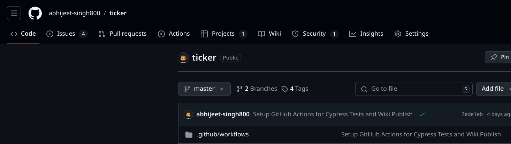

<h1 style="text-align:center;">  Ticker </h1>

<p style="text-align:center;">Ticker is an Open Source Chrome Extension that help you manage all your Productivity tools without interrupting your actual workflow. This project is focused on providing simplified user experience without hindering any functionalities you need in a daily manager. Our vision is to create an single stop personal productivity management solution that is easy to use,  starting with a To-Do List Manager. Thanks for checking it out</p>

<div align="center">

</div>

### 👉 Installing Instructions
This extension is currently not present in the Chrome Web Extension Store yet, so we going to load the extension using a Developer Mode. 
- Download the latest distribution files in the [release section](https://github.com/abhijeet-singh800/ticker/releases).
- Go to the extension page by visiting [`chrome://extensions/`](chrome://extensions/) and switch on `Developer Mode` on the top right corner of the screen.
- Now click on the `Load unpacked` on the top left corner of the screen and select the distribution folder downloaded prior, now you are ready to use the extension.

<div align="center">

</div>

### 👀 Uninstall Instructions
The uninstall procedure is same as all other Extensions, just go to [`chrome://extensions/`](chrome://extensions/) page on Chrome. Find the Ticker Extension Card and click `Remove` to uninstall.

### 🧪 Running Tests
This project uses the Cypress Testing Library , to run all the test in the terminal use 
the following command 
```bash
npm run tests
```

### 📖 Documentation 
All the documentation related to this project can be found in the Wiki Tab of the repository.

<div align="center">

</div>


### 🙋 Contribution 
Well you seem interested, Go Ahead fork the repository and produce some great work. Checkout the Wiki tab for this repository it should be helpful to accelerate your contribution journey. 

Don't worry if you do not have time to spare, you can still open a issue so that people are aware of the problem and start working on it or you can also support use by the word of mouth.

### 🔒 License
This project is follows the [MIT License](https://github.com/abhijeet-singh800/ticker/blob/master/LICENSE) 