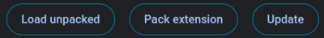

<h1 style="text-align:center;">  Ticker </h1>

Ticker is an Open Source Chrome Extension based on the React and was created to manage your to-do list on the fly without constantly switching tabs. This project is focused on providing simplified user experience without hindering any abilities you need in a you daily manager. Our vision is to create an single stop personal productivity management solution in a single extension that is easy to use starting with a To-Do List Manager. Thanks for checking it out

### 👉 Installing Instructions
This extension is currently not present in the Chrome Web Extension Store yet, so we going to load the extension using a Developer Mode. 
- Download the latest distribution files in the [release section](https://github.com/abhijeet-singh800/ticker/releases).
- Go to the extension page by visiting [`chrome://extensions/`](chrome://extensions/) and switch on `Developer Mode` on the top right corner of the screen.
- Now click on the `Load unpacked` on the top left corner of the screen and slect the distribution folder downloaded prior, now you are ready to use the extension.

### 👀 Uninstall Instructions
The uninstall procedure is same as all other Extensions, just go to [`chrome://extensions/`](chrome://extensions/) page on Chrome. Find the Ticker Extension Card and click `Remove` to uninstall.

### 📖 Documentation 
All the documentation related to this project can be found inside the `docs` folder. Further instruction on how to fully utilize documentation are also present in the said folder.
Documentations for understanding the source tree is also present in the `docs/internals` folder. For more information on incoming feature checkout `docs/incomming`. 

### 🙋 Contribution 
Well you seem intrested, Go Ahead fork the repository and produce some great work. Checkout the `docs/contributions` and `docs/internals` it should be helpful to acclearate your contribution journey. 
Dont worry if you dont have time to spare, you can still open a issue so that people are aware of the problem and start working on it or you can also support use by the word of mouth.

### 🔒 License
This project is follows the [MIT License](https://github.com/abhijeet-singh800/ticker/blob/master/LICENSE) 