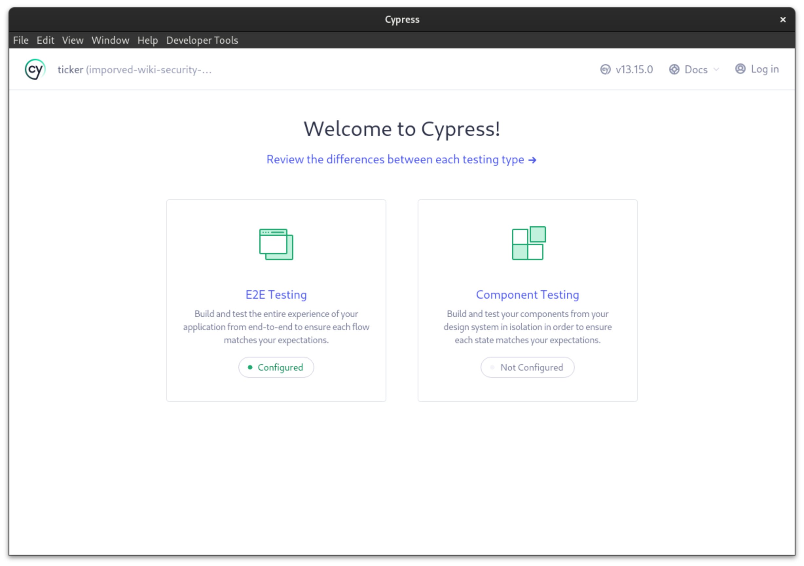

Tests ensure the code quality of the repository, Ticker uses the Cypress Testing library you can run these tests either in interactive or terminal mode. This project has `npm` scripts defined for each case. 

## Interactive Mode
In this mode Cypress opens an automated browser that runs all the tests so you can interact with the app if something goes wrong. You can also inspect the elements form this mode. To start the Cypress testing suit in an interactive mode use the following command 

```
npm run cypress
```

This will open an pop up window. Currently this project only uses the E2E testing strategies thus you have to click the option for `E2E Testing`

<div align="center">

</div>

No select you preferred browser and you will be presented with all your tests on the dashboard. To run an test just click on the file and it will execute that test file.

## Terminal Mode 
Sometime we just want to run all the task quickly without any feedback. To run all the tests for the repo in a quick fusion use the following command 

```
npm run tests
```