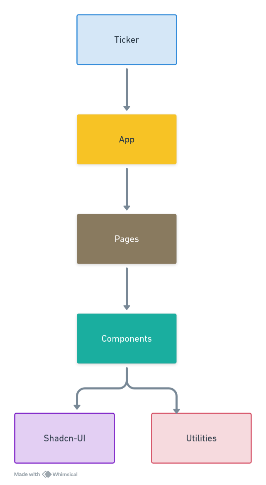

This repository follows a logical directory structure that is illustrated below followed by a brief note on each of the directories.
```
ticker
├── .github
├── cypress
├── docs
├── media 
├── public
└── src
    ├── components
    ├── pages
    ├── shadcn
    └── utils
```

- `.github` contains the YAML files for GitHub actions for this repository that manage Testing using Cypress and publishing docs on GitHub Wiki. For more information look into `Internals>GitHub Actions`
- `cypress` contains the all the tests files for the testing `ticker`. Apart from test files it also contains `fixtures` and `support` files that are used for mocking data and extending the capabilities of cypress respectively.
- `docs` contains the documentation markdown files for the GitHub Wiki. These files are processed by the GitHub Actions to build GitHub Wiki Pages.
- `media` contains all the screenshots and GIFs that are used in README and docs for effective communication.
- `public` contains the files that are required in the the build files. This is a unique folder that is contents are directly copied into the build folder.
- `src` folder actually contains the logic of the extension, organization of this folder is given below.
  
# Logical Structure of the Project 
Ticker is built in an with a hierarchy based structure. Smaller independent units are combined together into larger units. An illustration is given to understand this structure. 
<div align="center">

</div>

Ticker is an React app that is made up of Pages, these Pages are further made up form reuseable component that are base on Shadcn UI components , various utilities functions are also used for developing these components. The directory structure of the App also mirror these logical structure in the `src` folder. 

```
src
├── main.tsx
├── main.css
├── App.tsx
├── App.css
│
├── components
├── pages
├── shadcn
└── utils

```
`main.tsx` and `main.css` serves as the entry point for the server.`App.tsx` and `App.css` contain the main code for the Ticker, its is made up of from Pages which can be further broken down into Components that are made using ShadcnUI components. 