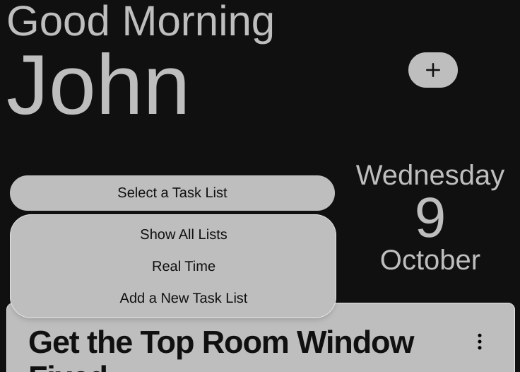
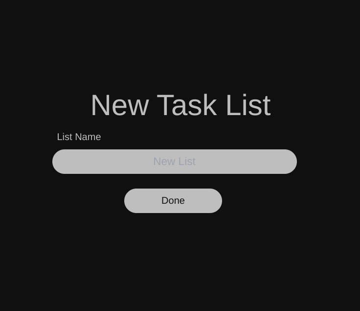

As explained earlier task list are a way for you to groups similar task together in the App, you have the option to create a new task when you are going through the onboarding process. 

In this document we will show how to create more task lists when you need more. Lets start form the Home Page, the option for creating new task list is present in the Task List filtering dropdown which is the top button on the Home Screen Panel. 

In the popup below the filter options you can see the `Add a New Task List` click it and you will be router to the new task list form.

Fill in the name you want and you click done , this will take you back to the home screen and add the new task list to the extension.