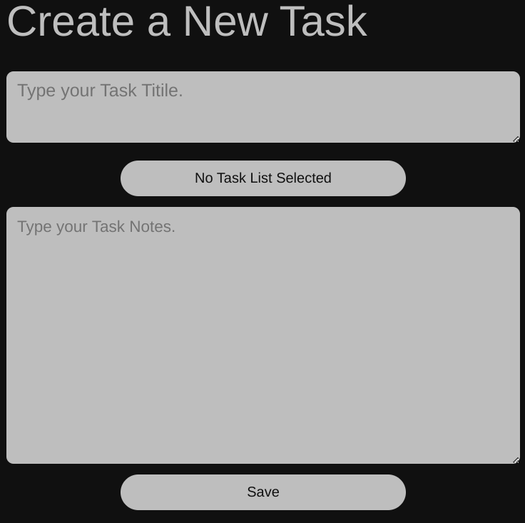
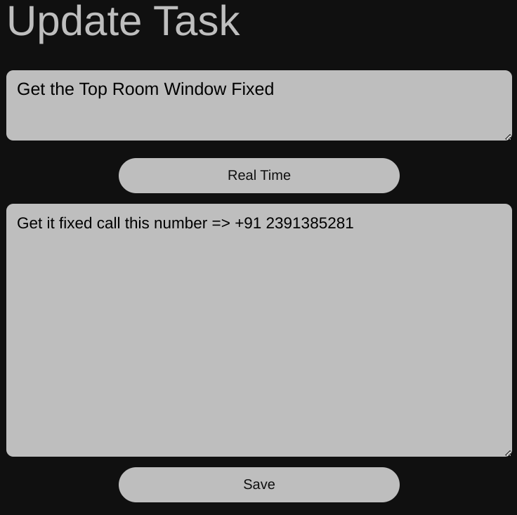
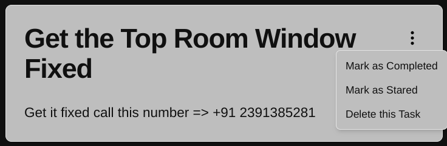
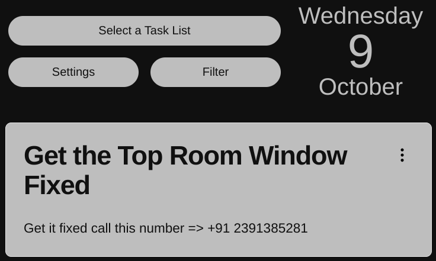

After reading this document you will be effectively manage your task ie creating a new task , updating tasks , changing properties , filtering tasks and deleting tasks. Without wasting any time lets start...

## Creating New Tasks 
To create new task you just click the Plus button beside the Greetings on the home page. This will take you to a New Task Form fill it and then press the Save button.

## Updating Tasks
To update tasks you need to click the Task card on the home screen which will take you to a similar task from, this will allow you to update your entries and press the save button which will take you back to the home screen.

## Changing the Task Properties
Task properties like completed or stared can be change by just clicking the three dot button on the task card on the home screen. 

## Filtering Task 
Filtering task can be a useful feature when you need to focus on one single property in all of your tasks. You can apply filtering options form Home Button Panel , you can also apply multiple filters by applying the Task List filer and Properties filter at the same time. 

## Deleting Task 
Finally to delete a task click the three dotted button in the task card at the home screen, and then click on the `Delete this Task` button on the popup. 

