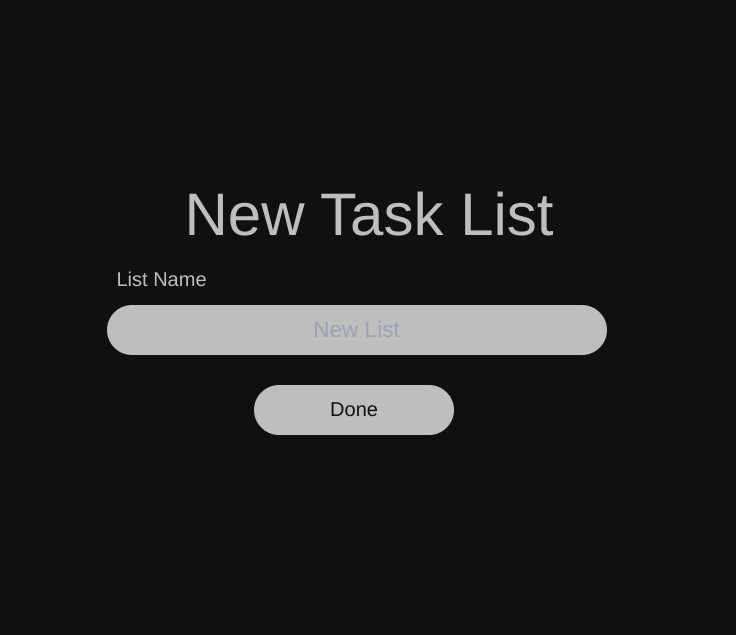

elcome to Ticker, this document will take you through the onboarding process (which is frankly very simple) and get you extension up and running. 

When you first open you extension you will be grated by the Onboarding screen, you need to add you name and nick name and press `Next`

After this screen you will be prompted to create a New task list. Task list are way to organize you task, name the task list in the from and click done. 

Welcome to your homescreen currently it will be empty because you don't have any tasks yet. To start managing task and using this extension effectively, read the documentation further. 

